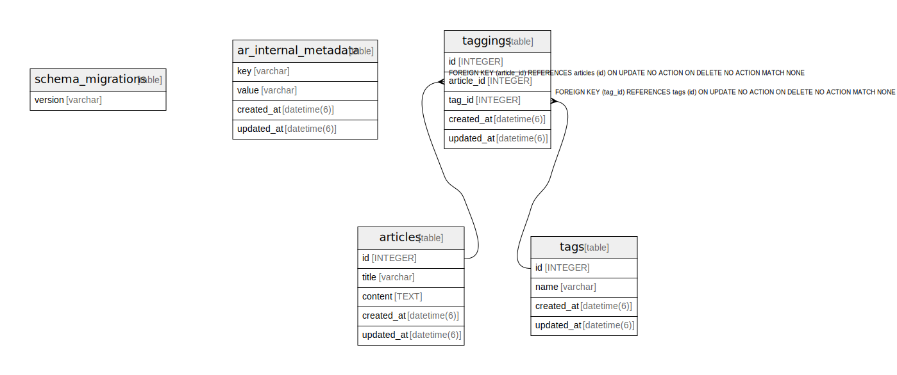

# development.sqlite3

## Tables

| Name | Columns | Comment | Type |
| ---- | ------- | ------- | ---- |
| [schema_migrations](schema_migrations.md) | 1 |  | table |
| [ar_internal_metadata](ar_internal_metadata.md) | 4 |  | table |
| [articles](articles.md) | 5 |  | table |
| [tags](tags.md) | 4 |  | table |
| [taggings](taggings.md) | 5 |  | table |

## Relations

---

> Generated by [tbls](https://github.com/k1LoW/tbls)
