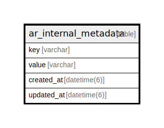

# ar_internal_metadata

## Description

<details>
<summary><strong>Table Definition</strong></summary>

```sql
CREATE TABLE "ar_internal_metadata" ("key" varchar NOT NULL PRIMARY KEY, "value" varchar, "created_at" datetime(6) NOT NULL, "updated_at" datetime(6) NOT NULL)
```

</details>

## Columns

| Name | Type | Default | Nullable | Children | Parents | Comment |
| ---- | ---- | ------- | -------- | -------- | ------- | ------- |
| key | varchar |  | false |  |  |  |
| value | varchar |  | true |  |  |  |
| created_at | datetime(6) |  | false |  |  |  |
| updated_at | datetime(6) |  | false |  |  |  |

## Constraints

| Name | Type | Definition |
| ---- | ---- | ---------- |
| key | PRIMARY KEY | PRIMARY KEY (key) |
| sqlite_autoindex_ar_internal_metadata_1 | PRIMARY KEY | PRIMARY KEY (key) |

## Indexes

| Name | Definition |
| ---- | ---------- |
| sqlite_autoindex_ar_internal_metadata_1 | PRIMARY KEY (key) |

## Relations



---

> Generated by [tbls](https://github.com/k1LoW/tbls)
