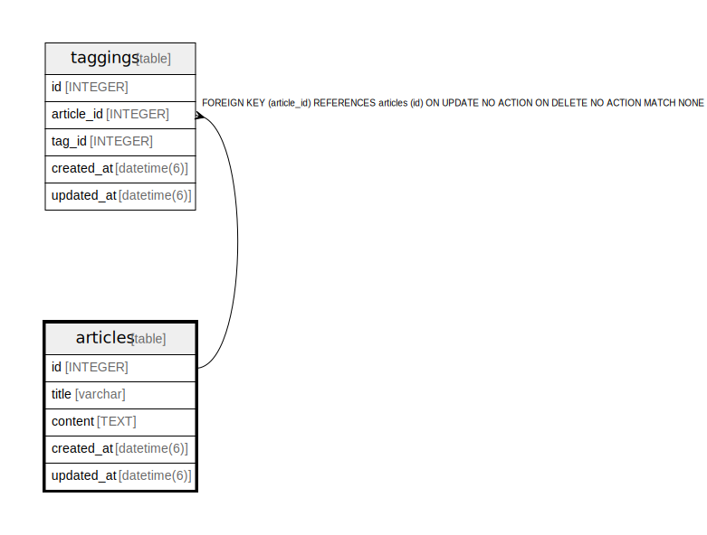

# articles

## Description

<details>
<summary><strong>Table Definition</strong></summary>

```sql
CREATE TABLE "articles" ("id" integer PRIMARY KEY AUTOINCREMENT NOT NULL, "title" varchar, "content" text, "created_at" datetime(6) NOT NULL, "updated_at" datetime(6) NOT NULL)
```

</details>

## Columns

| Name | Type | Default | Nullable | Children | Parents | Comment |
| ---- | ---- | ------- | -------- | -------- | ------- | ------- |
| id | INTEGER |  | false | [taggings](taggings.md) |  |  |
| title | varchar |  | true |  |  |  |
| content | TEXT |  | true |  |  |  |
| created_at | datetime(6) |  | false |  |  |  |
| updated_at | datetime(6) |  | false |  |  |  |

## Constraints

| Name | Type | Definition |
| ---- | ---- | ---------- |
| id | PRIMARY KEY | PRIMARY KEY (id) |

## Relations



---

> Generated by [tbls](https://github.com/k1LoW/tbls)
