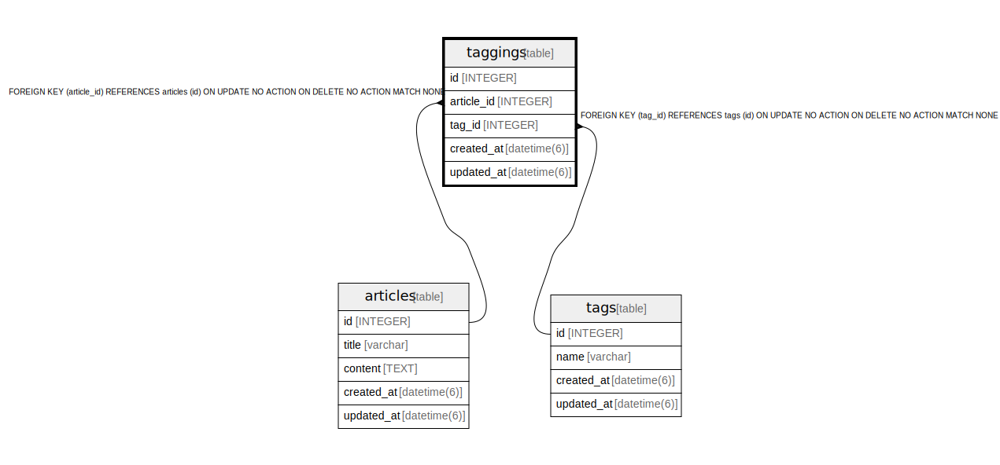

# taggings

## Description

<details>
<summary><strong>Table Definition</strong></summary>

```sql
CREATE TABLE "taggings" ("id" integer PRIMARY KEY AUTOINCREMENT NOT NULL, "article_id" integer NOT NULL, "tag_id" integer NOT NULL, "created_at" datetime(6) NOT NULL, "updated_at" datetime(6) NOT NULL, CONSTRAINT "fk_rails_50f62c287b"
FOREIGN KEY ("article_id")
  REFERENCES "articles" ("id")
, CONSTRAINT "fk_rails_9fcd2e236b"
FOREIGN KEY ("tag_id")
  REFERENCES "tags" ("id")
)
```

</details>

## Columns

| Name | Type | Default | Nullable | Children | Parents | Comment |
| ---- | ---- | ------- | -------- | -------- | ------- | ------- |
| id | INTEGER |  | false |  |  |  |
| article_id | INTEGER |  | false |  | [articles](articles.md) |  |
| tag_id | INTEGER |  | false |  | [tags](tags.md) |  |
| created_at | datetime(6) |  | false |  |  |  |
| updated_at | datetime(6) |  | false |  |  |  |

## Constraints

| Name | Type | Definition |
| ---- | ---- | ---------- |
| id | PRIMARY KEY | PRIMARY KEY (id) |
| - (Foreign key ID: 0) | FOREIGN KEY | FOREIGN KEY (tag_id) REFERENCES tags (id) ON UPDATE NO ACTION ON DELETE NO ACTION MATCH NONE |
| - (Foreign key ID: 1) | FOREIGN KEY | FOREIGN KEY (article_id) REFERENCES articles (id) ON UPDATE NO ACTION ON DELETE NO ACTION MATCH NONE |

## Indexes

| Name | Definition |
| ---- | ---------- |
| index_taggings_on_tag_id | CREATE INDEX "index_taggings_on_tag_id" ON "taggings" ("tag_id") |
| index_taggings_on_article_id | CREATE INDEX "index_taggings_on_article_id" ON "taggings" ("article_id") |

## Relations



---

> Generated by [tbls](https://github.com/k1LoW/tbls)
